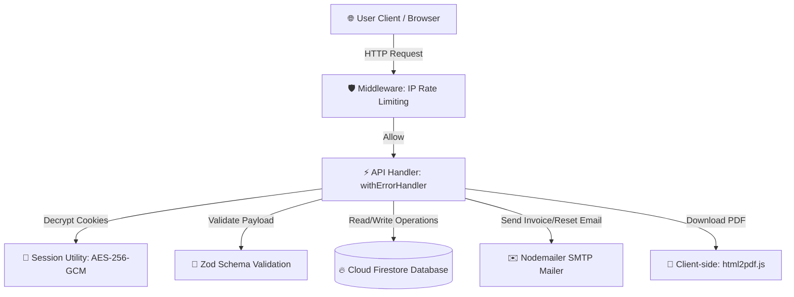

# 🧾 GST Invoice Generator & Management System

<div align="center">


A secure, production-grade billing and GST invoice management platform. Built to automate invoice generation, handle role-based workflows, compute regional tax rates, and deliver PDF statements.

[Live Demo](https://express-js-on-vercel-gopal-1995-11.vercel.app/) • [Report Bug](https://github.com/) • [Request Feature](https://github.com/)

</div>

---

## 🏗️ Architecture & Data Flow

Below is the workflow showing how incoming client requests are rate-limited, decrypted, validated, and processed before interacting with Firestore or dispatching emails:



---

## 🌟 Key Features

*   **👥 Role-Based Access Control (RBAC):**
    *   `Admin`: Directs user management, user activation/deactivation, password resets, and core business settings.
    *   `Staff`: General billing access—creates invoices, modifies customers, and updates the product catalog.
    *   `CA (Chartered Accountant)`: Read-only access to download detailed monthly/annual GST reports.
    *   `Customer`: Direct access to view their shared invoice using secure tokens (no login required).
*   **➕ Auto GST Calculations:** Automatic detection and separation of CGST (Central), SGST (State), or IGST (Integrated) depending on customer location vs. business headquarters.
*   **🔐 Strong Session Cryptography:** Sessions are protected using server-side stateless `AES-256-GCM` cookie encryption. Avoids plain JWT storage vulnerabilities.
*   **🛡️ Security & Rate Limiting:** Custom IP-based rate limiter middleware protects all authentication routes against brute-force and DDoS attempts.
*   **📧 Automated Email Dispatch:** Generates invoices as attachments and dispatches password reset links securely using Nodemailer.
*   **🔗 Secure Link Sharing:** Cryptographically secure hashes are generated per invoice so customers can review billing items online via unique tokens.

---

## ⚙️ Environment Variables Setup

Create a `.env` file in the root directory. Use the template below:

```bash
# ==========================================
# 📧 SMTP Configuration (Email Delivery)
# ==========================================
SMTP_HOST=smtp.gmail.com
SMTP_PORT=587
SMTP_USER=your-email@gmail.com
SMTP_PASS=your-app-password
SMTP_FROM=your-email@gmail.com

# ==========================================
# 🔑 Default Administrator Credentials
# ==========================================
DEFAULT_ADMIN_USERNAME=admin
DEFAULT_ADMIN_PASSWORD=ChangeMe@123

# ==========================================
# 🛡️ Cryptography & Session Management
# ==========================================
# Generate a strong 32-character random key
SESSION_SECRET=your-random-32-byte-secret-key-here

# ==========================================
# 🔥 Firebase Credentials (Vercel Production)
# ==========================================
# Copy the single-line string of your service-account.json file
FIREBASE_SERVICE_ACCOUNT={"type":"service_account","project_id":...}
```

> [!WARNING]
> **Never commit your `.env` file or `service-account.json` to GitHub.** 
> Both files are already ignored in `.gitignore`. Exposing private keys publicly puts your database at security risk.

---

## 💻 Local Development Setup

### 1. Prerequisites
Ensure you have **Node.js (v18+)** installed.

### 2. Installation
Install the project dependencies:
```bash
npm install
```

### 3. Setup Firebase Service Account
1. Go to your **Firebase Console**.
2. Navigate to **Project Settings > Service Accounts**.
3. Click **Generate New Private Key**.
4. Download the file, rename it to `service-account.json`, and place it in the root folder of this project.

### 4. Run Development Server
```bash
npm run dev
```
Open your browser to [http://localhost:3000](http://localhost:3000).

### 5. Build for Production
To build and check compilation errors locally:
```bash
npm run build
npm start
```

---

## ☁️ Deploying to Vercel

### Step 1: Create Vercel Project
1. Log in to [Vercel](https://vercel.com/dashboard).
2. Click **Add New > Project** and import your Git Repository.
3. In **Framework Preset**, select **Next.js**.

### Step 2: Configure Environment Variables
Copy all the environment variables from your local `.env` file into **Settings > Environment Variables**:
*   For `FIREBASE_SERVICE_ACCOUNT`, open your `service-account.json` file and copy/paste its **entire JSON content** as the value.

### Step 3: Set Your Production Branch
*   If your Next.js project is on a testing branch (e.g. `nextjs` or `testing`), go to **Settings > Git** and change the **Production Branch** to match your branch name. Vercel will rebuild and deploy the site instantly.

---

## ℹ️ Troubleshooting Tips

> [!TIP]
> **Using Gmail SMTP?**
> Standard passwords will be blocked by Google due to 2FA requirements. You must enable 2FA on your Google Account and generate an **App Password** from Google Account settings to set as your `SMTP_PASS`.

> [!NOTE]
> **First Run Database Seeding**
> On the first database connection, the application will automatically seed Firestore with default business settings, a few sample products/customers, and your initial administrator account.
